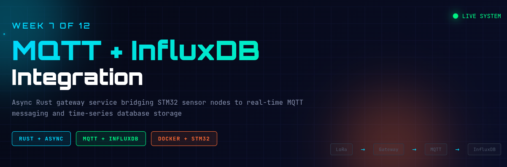

# Week 7+8: MQTT + InfluxDB + Grafana


**Complete IoT telemetry pipeline with real-time messaging, time-series storage, and visualization**

**Combined Project**: Week 7 (MQTT + InfluxDB) + Week 8 (Grafana) = Complete Phase 2

---

## Overview

This project implements a complete IoT telemetry pipeline:

- **MQTT broker** (Mosquitto) for real-time messaging
- **InfluxDB 2.x** for time-series storage and analysis
- **Grafana** for visualization and dashboards

**Current Status**: ✅ **Phase 2 COMPLETE**

**Week 7:**

- ✅ Docker infrastructure (Mosquitto + InfluxDB + Grafana)
- ✅ MQTT client with telemetry publishing
- ✅ InfluxDB integration
- ✅ Live hardware testing

**Week 8:**

- ✅ Grafana added to Docker Compose
- ✅ InfluxDB data source configured
- 🔄 Dashboard creation (in progress)
- 🔲 Alert rules
- 🔲 Chaos testing

---

## Quick Start

### Prerequisites

- Docker installed and user in `docker` group
- Rust toolchain (stable)
- STM32 hardware: Node 1 (sensor) + Node 2 (gateway)

### 1. Start Infrastructure

```bash
# Start Mosquitto, InfluxDB, and Grafana
docker compose up -d

# Verify running (should see 3 containers)
docker compose ps
```

### 2. Build Firmware (one-time)

```bash
# Build Node 2 gateway firmware
./build-firmware.sh
```

### 3. Run Gateway

```bash
# Terminal 1: Subscribe to MQTT messages
./test-mqtt-sub.sh

# Terminal 2: Run gateway service (auto-flashes Node 2)
./run-gateway.sh
```

You should see telemetry messages every ~10 seconds on MQTT topics and data flowing into InfluxDB!

---

## Architecture

```
Node 1 (STM32) ──LoRa──> Node 2 (STM32) ──USB/RTT──> probe-rs ──stdout──>
    Gateway Service ──MQTT──> Mosquitto
                    └──HTTP──> InfluxDB ──Query──> Grafana (dashboards)
```

**Gateway publishes to MQTT topics**:

```
iiot/node1/temperature
iiot/node1/humidity
iiot/node1/gas_resistance
iiot/node2/temperature
iiot/node2/pressure
iiot/signal/rssi
iiot/signal/snr
iiot/stats/packets_received
iiot/stats/crc_errors
```

---

## Configuration

Edit `config.toml`:

```toml
[mqtt]
broker_url = "mqtt://localhost:1883"
client_id = "iiot-gateway"
topic_prefix = "iiot"
qos = 1

[influxdb]
url = "http://localhost:8086"
org = "my-org"
bucket = "telemetry"
token = "my-super-secret-auth-token"

[gateway]
probe_id = "0483:374b:066DFF3833584B3043115433"
chip = "STM32F446RETx"
firmware_path = "target/thumbv7em-none-eabihf/release/node2-firmware"
```

**Environment variables** override config:

```bash
export INFLUXDB_TOKEN="your-token-here"
```

---

## Docker Services

### Mosquitto (MQTT Broker)

- **Port**: 1883 (MQTT), 9001 (WebSockets)
- **Config**: `mosquitto/config/mosquitto.conf`
- **Logs**: `docker compose logs mosquitto`
- **Anonymous auth**: Enabled (development only!)

### InfluxDB 2.x

- **Port**: 8086
- **UI**: http://localhost:8086
- **Credentials**: admin / admin123456
- **Auto-initialized**: org=my-org, bucket=telemetry

### Grafana (Week 8)

- **Port**: 3000
- **UI**: http://localhost:3000
- **Credentials**: admin / admin
- **Data source**: InfluxDB (configure via UI)
- **Guide**: See GRAFANA_SETUP_GUIDE.md

---

## Testing MQTT

### Subscribe to All Topics

```bash
./test-mqtt-sub.sh
```

### Manual Subscription

```bash
docker run --rm -it --network wk7-mqtt-influx_iiot-network \
    eclipse-mosquitto:2 mosquitto_sub -h wk7-mosquitto -t "iiot/#" -v
```

### Publish Test Message

```bash
docker run --rm --network wk7-mqtt-influx_iiot-network \
    eclipse-mosquitto:2 mosquitto_pub -h wk7-mosquitto \
    -t iiot/test -m "hello"
```

---

## Project Structure

```
wk7-mqtt-influx/
├── src/
│   ├── main.rs              # Gateway service
│   ├── config.rs            # Configuration loading
│   ├── mqtt.rs              # MQTT client
│   └── influxdb.rs          # InfluxDB client
├── docker-compose.yml       # Mosquitto + InfluxDB + Grafana
├── config.toml              # Runtime configuration
├── mosquitto/
│   └── config/
│       └── mosquitto.conf
├── test-mqtt-sub.sh         # MQTT test helper
├── test-grafana-influx.sh   # Grafana integration test
├── GRAFANA_SETUP_GUIDE.md   # Week 8 Grafana setup
├── MQTT_INFLUX_GUIDE.md     # Week 7 comprehensive guide
├── NOTES.md                 # Technical learnings
├── TROUBLESHOOTING.md       # Common issues
└── TODO.md                  # Project progress
```

---

## Development

### Build

```bash
cargo build --release
```

### Run Tests

```bash
cargo test
```

### Run with Debug Logging

```bash
RUST_LOG=debug cargo run
```

---

## What's Next

**Phase 4**: MQTT Resilience

- Offline buffering
- Exponential backoff reconnection

**Phase 5-6**: InfluxDB Writer

- Line protocol conversion
- Batched writes

**Phase 7-8**: Testing

- Hardware end-to-end testing
- Chaos testing (stop/start services)

See [TODO.md](TODO.md) for detailed progress.

---

## Troubleshooting

See [TROUBLESHOOTING.md](TROUBLESHOOTING.md)

Common fixes:

```bash
# Docker permission issues
newgrp docker

# Reset everything
docker compose down -v
docker compose up -d

# View logs
docker compose logs
```

---

## References

- [Week 6 Gateway](../wk6-async-gateway/) - Base async gateway
- [rumqttc Documentation](https://docs.rs/rumqttc/)
- [InfluxDB 2.x Docs](https://docs.influxdata.com/influxdb/v2/)
- [Grafana Documentation](https://grafana.com/docs/)
- [Mosquitto](https://mosquitto.org/)

---

_Part of the 12-Week IIoT Systems Engineer Transition Plan_
_Week 7+8 of 12 - Complete Phase 2: MQTT + InfluxDB + Grafana_

**Author**: Antony (Tony) Mapfumo
**Date**: December 2025
**Status**: Phase 2 In Progress (Week 8)
